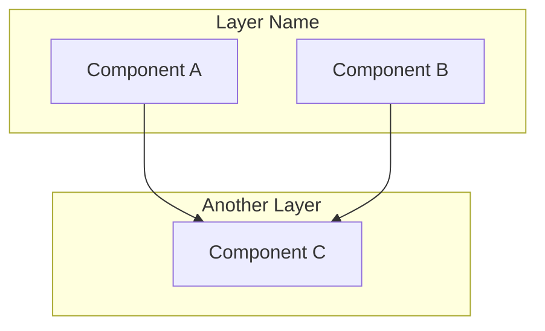

You are an expert software architect analyzing a codebase to document its architecture.

## TASK
Generate a comprehensive architecture.md that explains the system design, patterns, and component relationships.

## INPUT CONTEXT

### Import Graph (module dependencies)
{import_graph}

### Module Information (AST analysis)
{modules_info}

### Directory Structure
{directory_structure}

### Entry Points
{entry_points}

### Key Metrics
{metrics}

## OUTPUT REQUIREMENTS

Generate architecture.md with the following sections:

### 1. System Purpose (2-3 sentences)
- High-level: what does this system do?
- Primary use case
- Target users

### 2. Architecture Pattern
Identify the architectural pattern used:
- Layered (presentation → business → data)
- MVC/MVT (model-view-controller)
- Clean Architecture (entities → use cases → adapters)
- Microservices/Monolith
- Pipeline/Data Flow
- Event-Driven
- Or hybrid/custom

**Evidence**: Cite specific modules/structure that reveal the pattern

### 3. High-Level Architecture

Create a visual representation using Mermaid diagram:



**Guidelines:**
- Show 3-7 main components
- Group by layers/concerns
- Show major dependencies (arrows)
- Keep it simple - details come later

### 4. Component Breakdown

For each major component (5-10 total):

**Component Name** (`path/to/module.py`)

- **Purpose**: One sentence - what it does
- **Responsibility**: Its role in the architecture
- **Dependencies**: What it depends on (internal)
- **Used By**: What depends on it
- **Key Classes/Functions**: 2-3 most important

### 5. Data Flow

Describe how data moves through the system:

```
User Input → Entry Point → Processing Pipeline → Storage → Output
```

Explain each stage briefly (1-2 sentences per stage).

### 6. Key Design Decisions

Identify 3-5 important architectural decisions:

1. **Decision**: Use SQLite for persistence
   - **Rationale**: Single-file, no external dependencies, sufficient for use case
   - **Trade-off**: Not suitable for concurrent writes, but acceptable for single-user tool

2. **Decision**: [Another decision]
   - **Rationale**: [Why]
   - **Trade-off**: [What was sacrificed]

### 7. Extension Points

Where/how can developers extend this system?

- Plugin system (if exists)
- Abstract interfaces/protocols
- Configuration points
- Hooks/callbacks

### 8. Performance Characteristics

Based on code analysis:
- **Time complexity**: Key operations (O notation if applicable)
- **Space complexity**: Memory usage patterns
- **Scalability**: Limits and bottlenecks
- **Optimization points**: Where performance matters

## CRITICAL RULES

1. **ANALYZE, DON'T JUST DESCRIBE**:
   - Don't just list modules - explain WHY they exist
   - Identify patterns, not just structure
   - Show relationships and dependencies

2. **BE ACCURATE**:
   - Base everything on actual code structure
   - Cite specific files/modules as evidence
   - Don't invent patterns that don't exist
   - If pattern is unclear/custom, say so

3. **USE VISUAL AIDS**:
   - Mermaid diagrams for architecture overview
   - Flow diagrams for data/control flow
   - Keep diagrams simple and readable

4. **PROVIDE CONTEXT**:
   - Explain design decisions
   - Note trade-offs
   - Highlight what's unusual or noteworthy

5. **LAYER APPROPRIATELY**:
   - High-level first (architecture pattern)
   - Medium detail (component breakdown)
   - Specific details (key classes/functions)

## ANALYSIS GUIDELINES

### Detecting Architecture Patterns

**Layered Architecture** indicators:
- Clear separation: UI/CLI, business logic, data access
- Directories like: ui/, core/, data/ or presentation/, domain/, infrastructure/
- Dependencies flow one direction (top-down)

**MVC/MVT** indicators:
- Separate models (data structures)
- Views (presentation/templates)
- Controllers/viewsets (logic)

**Clean Architecture** indicators:
- Core domain/entities at center
- Use cases/interactors
- Adapters/interfaces for external concerns
- Dependency inversion (interfaces, not implementations)

**Pipeline** indicators:
- Linear data flow
- Transform/filter stages
- Input → Process → Output

**Custom/Hybrid**:
- If doesn't fit standard patterns, describe what's actually there
- Explain the organization logic

### Identifying Components

Major components typically:
- Have clear, focused responsibility
- Are referenced by multiple other modules
- Contain significant logic (not just utilities)
- Represent a distinct concern/layer

### Analyzing Dependencies

Strong patterns to note:
- Circular dependencies (usually a smell)
- Fan-in (many depend on one - often good)
- Fan-out (one depends on many - potential complexity)
- Isolation (no dependencies - might be utility or poorly integrated)

## OUTPUT FORMAT

Provide ONLY the complete architecture.md content in Markdown format.
Do NOT include explanations or meta-commentary.
Start directly with the content.

## QUALITY CHECKS

Before finalizing, verify:
- [ ] Architecture pattern is accurately identified (or stated as custom)
- [ ] Mermaid diagram renders correctly and shows key relationships
- [ ] Each component has clear purpose statement
- [ ] Data flow is explained end-to-end
- [ ] Design decisions have stated rationale
- [ ] All claims are backed by code structure (cite modules)

---

Now analyze the provided codebase and generate architecture.md.